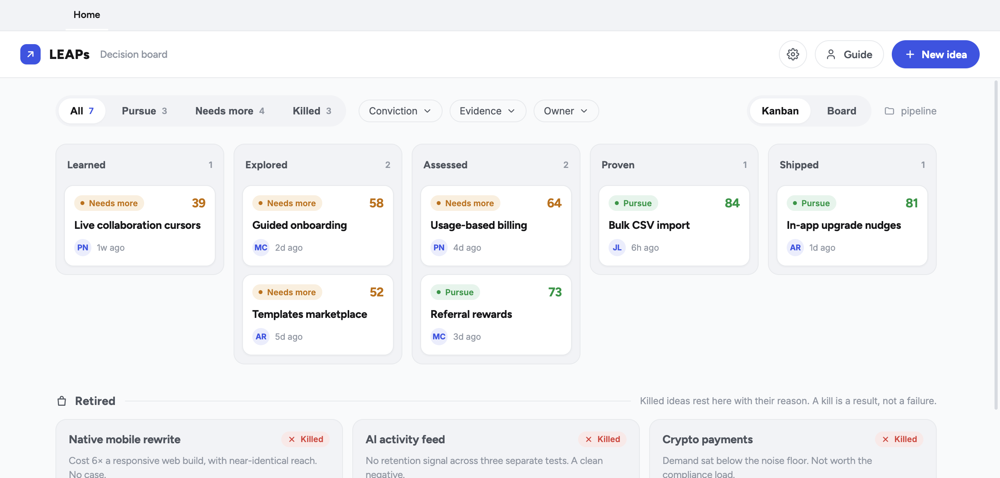
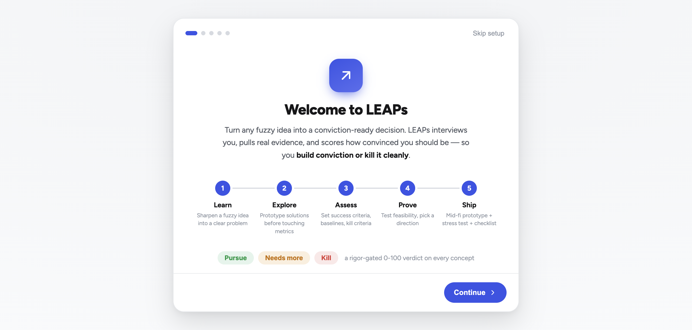

# LEAPs

**A local-first product-discovery tool.** LEAPs takes any fuzzy idea and grinds it
into a conviction-ready decision through a five-stage pipeline —
**Learn → Explore → Assess → Prove → Ship** — scored by a rigor-gated **conviction
model** (0–100, *Pursue / Needs more / Kill*) that can only run high when claims are
backed by real, sourced evidence.

It runs on your machine, connects to *your* tools (BI, analytics, design,
tickets — anything with an MCP server), and grounds every question in *your*
company and role. No accounts, no hosted backend, no SSO — clone it and go.

> Built for PMs, CPOs, and commercial folks doing light discovery to **build
> conviction or kill an idea** — instead of debating PRDs and decks.



## Requirements

- **[Claude Code](https://claude.com/claude-code) (the `claude` CLI)** — installed
  and signed in (run `claude` once, then `/login`). LEAPs drives *your own* local
  Claude to run discovery, so this is required for the conversation pane to pull
  evidence and move conviction. (Without it you can still browse the board and the
  sample concept — you just can't run live discovery.)
- **Node.js 18+** — 20 is recommended (pinned in `.nvmrc`).
- **macOS, Windows, or Linux** to run from source. The packaged build
  (`npm run build`) targets **macOS on Apple Silicon**.

## Quick start

```bash
git clone https://github.com/tonyfadel23/leaps.git
cd leaps
npm install
npm start          # launches the desktop app (Electron)
```

On first run, a short setup walks you through signing into Claude, pointing LEAPs
at your concepts folder and tools, an optional design-system connect, and your
business context (company, role, goals) — then drops you on the board with a
sample concept to explore. (Conviction thresholds and everything else are
editable later in **Settings**.)



To build a packaged macOS app (Apple Silicon):

```bash
npm run build      # -> dist/mac-arm64/LEAPs.app  (unsigned — see "Staying up to date")
```

## How it works

- **Concepts are folders.** Each idea lives in `pipeline/{slug}/` as plain files
  (markdown, JSON, HTML prototypes). Nothing is locked in a database.
- **The pipeline is Claude Code skills.** `/learn`, `/explore`, `/assess`,
  `/prove`, `/ship` are conversation-first skills under `.claude/`.
- **Conviction is one engine.** `electron/engine/conviction.js` scores Problem,
  Size, Feasibility, and Evidence quality into a single verdict. The brief shows
  it; `/eval` audits it (it cannot be talked up, only sourced up).
- **Live discovery drives your own Claude.** The conversation pane spawns your
  local `claude` CLI inside a concept folder, using your auth and your connected
  tools to actually pull evidence and move conviction.

## Connect your tools

LEAPs wires data sources into discovery via **MCP servers** declared in
`connectors.yaml` (a sample ships as `connectors.example.yaml`). Map a semantic
role (e.g. `metrics_source`, `knowledge_base`) to any MCP — Looker, BigQuery, a
data gateway, Figma, Jira, Slack, etc.

```bash
# in the app's conversation, or a terminal Claude session:
/setup             # scan your MCPs and write connectors.yaml
```

Settings shows which sources are wired. Your filled-in `connectors.yaml` is
gitignored — keep internal endpoints out of commits.

## Give it your context

Copy `.claude/skills/_shared/reference/business-context.example.md` to
`business-context.md` and fill in your **company, markets, OKRs, and your role &
scope**. The skills and the discovery agent read it to ground every question in
your business — and the `pm-*` agents adopt the decision lens you describe.
(Your filled-in copy is gitignored.)

## Staying up to date

- **Running from source (recommended):** `git pull && npm install`. That's the
  whole update.
- **Packaged app:** because it ships **unsigned**, macOS blocks it on first open —
  right-click the app → **Open** (or **System Settings → Privacy & Security → Open
  Anyway**) once, and it runs normally after. LEAPs checks GitHub Releases on launch
  and via *Check for Updates…* in the menu, and points you to the new build. It does
  **not** silently self-install — that needs a code-signed app, and LEAPs ships
  unsigned (free OSS).
  If you fork and sign it, swap `electron/engine/update.js` for `electron-updater`
  against the same releases feed; the seam (check → notify) is unchanged.

## Testing

```bash
npm test          # engine/script unit tests + structural skill/agent checks
npm run eval      # + contract tests over your pipeline ideas
```

Skills and agents are prompts, so they're validated by a three-tier pyramid
(structural → contract → LLM-as-Judge via `/eval`) instead of unit tests — see
[`evals/agent-tests/README.md`](evals/agent-tests/README.md).

## Roadmap

LEAPs is local-first today. Multi-person collaboration on a concept
(Google-Docs / Miro style) is the next milestone — see
[`docs/collaboration.md`](docs/collaboration.md) for the design.

## Contributing

See [CONTRIBUTING.md](CONTRIBUTING.md). Issues and PRs welcome.

## License

[MIT](LICENSE).
